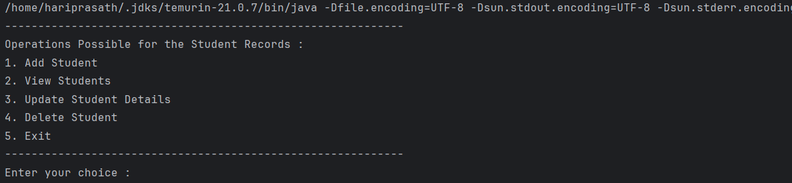
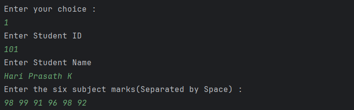

# 🎓 CLI Student Management System in Java

---

## ✨ Features

- ➕ Add student records with ID, Name, and Marks
- 📋 View all student details
- ✏️ Update student information interactively
- ❌ Delete student records by ID
- ✅ Input validation for reliable operations
- 🧠 Object-Oriented Programming (OOP) design

---

## 📸 Demo

Here’s how the system looks and works in the terminal:


*Main menu with user options*


*Adding a student record*


*Updating student records*


*Delete student records*

---

## 📁 Project Structure

```aiignore

elevate-student-manager/
├── StudentManager.java
├── images/
│ ├── menu.png
│ ├── add-student.png
│ └── view-students.png
└── README.md


```


---

## 🚀 How to Run

### 1. Compile the program
```
bash
javac StudentManager.java

```

### 2. Run the application
```
java StudentManager
```

🛠 Tech Stack
☕ Java SE

🖥️ Command Line Interface

🌱 OOP Principles

🔧 Git & GitHub

🔮 Future Enhancements
Store student records in a file or database

Add average and grade calculation

Sort students by marks or names

GUI version using JavaFX or Swing

Add unit testing using JUnit

🙋‍♂️ Author
Made with ❤️ by HARI PRASATH K
🚀 Java Developer @ Elevate Lab

⭐️ Show Your Support
If you found this project helpful:

🌟 Star this repository

🍴 Fork it for your own use

📣 Share it with fellow learners

Thank you for visiting! 🙌